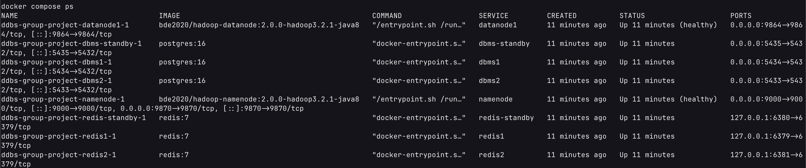

# Screenshot Guide for Report Submission

This guide provides the exact commands needed to capture all screenshots required for the project report. Each screenshot corresponds to a specific section in the report template.

## Prerequisites

**IMPORTANT:** Before taking screenshots, ensure the system is fully set up with production data:

```bash
# Complete setup (run once, takes 5-10 minutes)
make setup-10g
```

This populates the system with:
- 10,000 users (60% Beijing, 40% Hong Kong)
- 10,000 articles with real BBC news texts
- 1,000,000 read records
- Real images and videos uploaded to HDFS
- Be-Read and Popular-Rank tables fully populated

**Screenshot Settings:**
- Terminal font size: 14pt minimum
- Terminal width: 100+ columns (avoid line wrapping)
- Theme: Dark theme recommended for readability
- Format: PNG (higher quality than JPEG)
- Clear terminal before each screenshot: `clear`

---

## Required Screenshots (8 Total)

### 1. System Deployment (Report Section 5.1)

**Purpose:** Show all infrastructure components running

**Command:**
```bash
clear && make ps
```

**Alternative:**
```bash
clear && docker compose ps
```

**What to capture:**
- All containers running (dbms1, dbms2, dbms1-standby, redis*, namenode, datanode*)
- Status should be "Up" or "running"
- Port mappings visible

**Report caption:**
```
Figure 5.1: System deployment showing all distributed components operational (2 PostgreSQL instances, Redis cache, HDFS cluster with standby)
```

---

### 2. Data Distribution Verification (Report Section 5.2)

**Purpose:** Verify horizontal fragmentation is correctly implemented

**Command:**
```bash
clear && make verify-data
```

**Alternative:**
```bash
clear && uv run python src/cli/monitor.py distribution
```

**What to capture:**
- User counts: DBMS1 (Beijing) vs DBMS2 (Hong Kong)
- Article counts: Science replicated on both, Technology on DBMS2 only
- Read counts: Co-located with users
- Be-Read and Popular-Rank distribution

**Report caption:**
```
Figure 5.2: Data distribution verification showing correct horizontal fragmentation across DBMS1 and DBMS2
```

---

### 3. Query Performance with Caching (Report Section 5.3)

**Purpose:** Demonstrate cache performance

**Step 1 - First execution (cache miss):**
```bash
clear && uv run python src/cli/query.py execute --sql "SELECT uid, name, region FROM \"user\" WHERE region='Beijing' LIMIT 5"
```

**Step 2 - Second execution (cache hit):**
```bash
uv run python src/cli/query.py execute --sql "SELECT uid, name, region FROM \"user\" WHERE region='Beijing' LIMIT 5"
```

**What to capture:**
- Both executions in one screenshot (scroll to show both)
- OR take two separate screenshots
- Second execution should show faster response time
- Cache hit message visible

**Report caption:**
```
Figure 5.3: Query performance comparison showing cache effectiveness (first execution vs cached execution with 60s TTL)
```

---

### 4. Distributed Join - Top-5 Articles (Report Section 5.4)

**Purpose:** Demonstrate distributed join between Popular-Rank and Article tables

**Command:**
```bash
clear && make top5-daily
```

**Alternative:**
```bash
clear && uv run python src/cli/query.py top5 --granularity daily
```

**What to capture:**
- Top-5 articles with complete details
- Article titles, categories, abstracts
- Image and text file paths
- Ranking order maintained

**Report caption:**
```
Figure 5.4: Top-5 daily popular articles with distributed join fetching article details from both DBMS
```

---

### 5. System Monitoring (Report Section 5.5)

**Purpose:** Show comprehensive monitoring capabilities

**Command:**
```bash
clear && make monitor
```

**Alternative:**
```bash
clear && uv run python src/cli/monitor.py summary
```

**What to capture:**
- DBMS status (all online)
- Row counts per table
- Redis cache status and hit rate
- Clean, readable output

**Report caption:**
```
Figure 5.5: System monitoring summary showing DBMS status, data metrics, and cache performance
```

---

### 6. Hot/Cold Standby - System Status (Report Section 5.7)

**Purpose:** Show DBMS1-STANDBY running alongside primary databases

**Command:**
```bash
clear && uv run python src/cli/monitor.py status
```

**What to capture:**
- DBMS1 (Primary): ONLINE, port 5434
- DBMS1-STANDBY (Standby): ONLINE, port 5435
- DBMS2: ONLINE, port 5433
- All three databases operational

**Report caption:**
```
Figure 5.6: System status showing primary DBMS1, hot standby DBMS1-STANDBY, and DBMS2 all operational
```

---

### 7. Failover Test - Normal Operation (Report Section 5.7)

**Purpose:** Show query execution on primary DBMS1 before failure

**Command:**
```bash
clear && uv run python src/cli/query.py execute --sql "SELECT uid, name, region FROM \"user\" WHERE region='Beijing' LIMIT 3" --no-cache
```

**What to capture:**
- Query executing successfully
- Response time shown
- Results returned correctly
- No error messages

**Report caption:**
```
Figure 5.7: Query execution on primary DBMS1 under normal operation before failover test
```

---

### 8. Failover Test - Automatic Failover (Report Section 5.7)

**Purpose:** Demonstrate automatic failover to standby when primary fails

**Commands (run in sequence):**
```bash
# Stop primary DBMS1
docker stop ddbs-group-project-dbms1-1

# Wait a moment, then execute same query
uv run python src/cli/query.py execute --sql "SELECT uid, name, region FROM \"user\" WHERE region='Beijing' LIMIT 3" --no-cache
```

**What to capture:**
- Warning message: "⚠ DBMS1 failed, trying standby DBMS1-STANDBY"
- Query succeeds with results from standby
- Same data as before (demonstrating consistency)
- Zero downtime

**IMPORTANT:** After taking this screenshot, restart DBMS1:
```bash
docker start ddbs-group-project-dbms1-1
```

**Report caption:**
```
Figure 5.8: Automatic failover to DBMS1-STANDBY when primary DBMS1 fails, demonstrating fault tolerance with zero downtime
```

---

## Screenshot Checklist

Before submitting, verify you have:
- [ ] Screenshot 1: System deployment (docker ps)
- [ ] Screenshot 2: Data distribution (monitor distribution)
- [ ] Screenshot 3: Query caching (first vs cached execution)
- [ ] Screenshot 4: Distributed join (top5 daily)
- [ ] Screenshot 5: System monitoring (monitor summary)
- [ ] Screenshot 6: Standby status (all 3 DBMS online)
- [ ] Screenshot 7: Normal operation (query before failure)
- [ ] Screenshot 8: Failover test (automatic failover)

## File Naming Convention

Save screenshots as:
```
docs/screenshots/
├── 01_system_deployment.png
├── 02_data_distribution.png
├── 03_query_caching.png
├── 04_distributed_join.png
├── 05_system_monitoring.png
├── 06_standby_status.png
├── 07_normal_operation.png
└── 08_failover_test.png
```

## Inserting Screenshots in Report

**Markdown:**
```markdown

```

**LaTeX:**
```latex
\begin{figure}[h]
\centering
\includegraphics[width=0.9\textwidth]{screenshots/01_system_deployment.png}
\caption{System deployment showing all distributed components operational}
\label{fig:system_deployment}
\end{figure}
```

## Quick Screenshot Session Script

Run all commands in sequence and screenshot each (total time: ~5 minutes):

```bash
# Setup (if not already done)
make setup-10g

# 1. System deployment
clear && make ps

# 2. Data distribution
clear && make verify-data

# 3. Query caching (run twice)
clear && uv run python src/cli/query.py execute --sql "SELECT uid, name, region FROM \"user\" WHERE region='Beijing' LIMIT 5"
uv run python src/cli/query.py execute --sql "SELECT uid, name, region FROM \"user\" WHERE region='Beijing' LIMIT 5"

# 4. Distributed join
clear && make top5-daily

# 5. System monitoring
clear && make monitor

# 6. Standby status
clear && uv run python src/cli/monitor.py status

# 7. Normal operation
clear && uv run python src/cli/query.py execute --sql "SELECT uid, name, region FROM \"user\" WHERE region='Beijing' LIMIT 3" --no-cache

# 8. Failover test
docker stop ddbs-group-project-dbms1-1
uv run python src/cli/query.py execute --sql "SELECT uid, name, region FROM \"user\" WHERE region='Beijing' LIMIT 3" --no-cache

# IMPORTANT: Restart DBMS1
docker start ddbs-group-project-dbms1-1
```

---

## Troubleshooting

**Issue:** Screenshots are too small to read
- **Solution:** Increase terminal font size to 14pt or larger

**Issue:** Text is wrapped/truncated
- **Solution:** Increase terminal width to 120+ columns

**Issue:** DBMS not responding
- **Solution:** Run `make monitor` to check status, restart with `make setup` if needed

**Issue:** No data after restart
- **Solution:** Data persists in Docker volumes, but you may need to run `make setup-10g` again

---

## Final Notes

- Take screenshots in a clean environment (no other terminal output visible)
- Ensure all timestamps are recent (showing the system is actively running)
- Double-check that all required data is visible in each screenshot
- Keep raw screenshots (PNG format) in case you need to recrop/adjust
